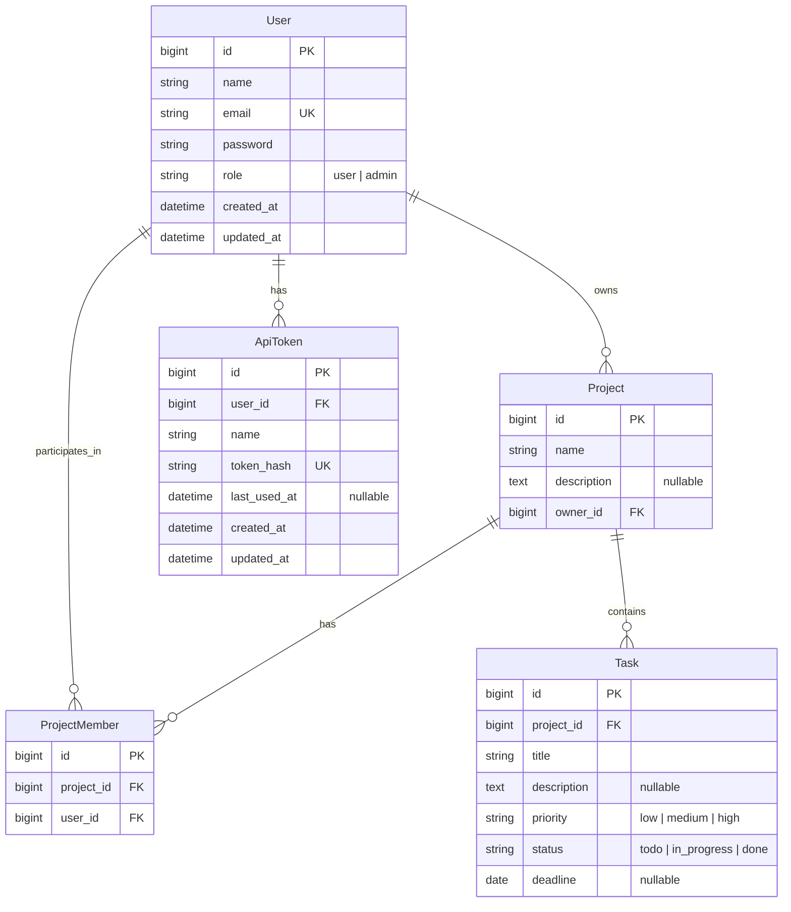

# TaskTeam (Jara) — Aplikasi Manajemen Tugas & Kolaborasi Tim
> **Repositori Resmi:** PPK Kelompok 2 Kelas C  
> **Mata Kuliah / Praktikum:** Praktikum Pemrograman Komputer (PPK)  
> **Tech Stack:** Laravel Framework (PHP) • Inertia.js / Blade • React 19 • Tailwind CSS • MySQL 8.4

---

## 📌 1. Deskripsi Proyek

**TaskTeam (Jara)** adalah aplikasi berbasis web yang dirancang untuk mempermudah individu dan tim dalam merencanakan, mengorganisasi, dan memantau penyelesaian tugas secara terstruktur dan transparan.

Aplikasi ini mendukung alur kerja kolaboratif:
- **Pengguna** dapat membuat ruang kerja (*project*), mengatur prioritas dan tenggat waktu tugas, menandai tugas yang telah rampung, serta mengundang anggota tim untuk berkolaborasi.
- **Pemilik Proyek (*Project Owner*)** memiliki kontrol penuh terhadap keanggotaan dan pengaturan proyek.
- **Admin Sistem** memiliki hak akses khusus untuk mengelola akun pengguna di seluruh sistem.
- **Metrik Progres Real-time** menghitung persentase penyelesaian tugas secara dinamis dan mendeteksi tugas yang mendekati atau telah melewati tenggat waktu (*overdue*).

---

## 👥 2. Tim Pengembang & Pembagian Tugas

Proyek ini dikembangkan oleh **Kelompok 2 Kelas C** dengan pembagian tanggung jawab teknis sebagai berikut:

| Peran | Penanggung Jawab | Fokus Utama | Lingkup Pekerjaan |
| :--- | :--- | :--- | :--- |
| **Rafi Anandra Dharmawan 24060124130071** | *Backend Core & Admin* | Autentikasi, Keamanan, & Akun User | Skema tabel `users`, registrasi & login, hashing password, otorisasi role (`admin` vs `pengguna`), middleware token/sesi, serta API CRUD User oleh Admin. |
| **Yuma Hazza Yuditama 24060124120035** | *Backend Project & Task* | Logika Bisnis Proyek & Tugas | Skema tabel `projects`, `project_members`, `tasks`, API CRUD Proyek & Anggota, API CRUD Tugas & Status, kalkulasi persentase progres, dan query filter deadline. |
| **Rio Setiawan Hastanu Putra 24060124130068** | *Frontend UI/UX & Integrasi* | Antarmuka Pengguna & Integrasi Sistem | Antarmuka web responsif, layout & proteksi halaman, form login/register, dashboard metrik, board/list tugas, modal tugas & anggota, UI admin, serta integrasi penuh ke backend. |

### Matriks Tanggung Jawab & Integrasi

```
┌──────────────────────────────────────┐       ┌──────────────────────────────────────┐
│             Programmer 1             │       │             Programmer 2             │
│        (Backend Core & Admin)        │       │       (Backend Project & Task)       │
│  - User Schema & Role RBAC           │       │  - Project & Task Schema             │
│  - Auth API (Register/Login/Logout)  │       │  - Project & Member Management API   │
│  - Admin User Management API         │       │  - Task CRUD & Progress Calculation  │
└──────────────────┬───────────────────┘       └──────────────────┬───────────────────┘
                   │                                              │
                   │         Standardized API & Data Contract     │
                   └──────────────────────┬───────────────────────┘
                                          │
                                          ▼
                      ┌───────────────────────────────────────┐
                      │             Programmer 3              │
                      │     (Frontend UI/UX & Integrasi)      │
                      │  - Responsive UI/UX (Desktop & Mobile)│
                      │  - Auth & Admin Route Protection      │
                      │  - Dashboard & Project Board UI       │
                      │  - Task & Member Modals               │
                      │  - Dynamic Progress Bar & Filters     │
                      │  - Full API Integration & Feedback    │
                      └───────────────────────────────────────┘
```

---

## 🚀 3. Fitur Utama Aplikasi (Berdasarkan PRD)

### 3.1. Autentikasi & Otorisasi
- **Registrasi & Login Akun**: Pendaftaran akun baru dengan validasi format email unik dan password yang diamankan dengan algoritma hashing bcrypt.
- **Multi-Role Access**:
  - **Pengguna Biasa**: Mengelola proyek sendiri dan berkolaborasi pada proyek yang diundang.
  - **Admin**: Akses panel khusus untuk mengelola, menambah, dan menghapus pengguna sistem.
- **Proteksi Rute**: Mengalihkan pengguna non-otentikasi ke halaman login dan membatasi halaman admin hanya untuk role `admin`.

### 3.2. Ruang Kerja & Kolaborasi Proyek
- **Multi-Project Support**: Pengguna dapat membuat lebih dari satu proyek/daftar tugas.
- **Kepemilikan Proyek (*Project Ownership*)**: Setiap proyek memiliki satu pemilik tetap (*owner*).
- **Manajemen Anggota**: Pemilik proyek dapat mengundang anggota melalui email dan mengeluarkan anggota dari proyek.
- **Akses Anggota**: Anggota yang tergabung dapat melihat seluruh tugas dalam proyek tersebut.

### 3.3. Pengelolaan Tugas (*Task Management*)
- **Atribut Tugas Lengkap**: Judul tugas, deskripsi, status, prioritas, dan tenggat waktu (*deadline*).
- **Klasifikasi Status Tugas**:
  - `Belum dikerjakan` (*To Do*)
  - `Sedang dikerjakan` (*In Progress*)
  - `Selesai` (*Completed*)
- **Klasifikasi Prioritas Tugas**:
  - `Rendah` (*Low*)
  - `Sedang` (*Medium*)
  - `Tinggi` (*High*)
- **Quick Status Toggle**: Kemudahan menandai tugas selesai langsung dari kartu tugas.

### 3.4. Kalkulasi & Pemantauan Progres
- **Persentase Progres Otomatis**: Dihitung dengan formula:
  $$\text{Progres} = \frac{\text{Jumlah Tugas Selesai}}{\text{Jumlah Seluruh Tugas}} \times 100\%$$
  *(Bernilai 0% jika proyek belum memiliki tugas)*.
- **Monitoring Tenggat Waktu**:
  - Filter tugas yang mendekati tenggat waktu (*Due Soon*).
  - Indikator peringatan visual untuk tugas yang telah melewati batas waktu (*Overdue*).

### 3.5. Panel Administrasi Pengguna
- Melihat daftar lengkap pengguna terdaftar dalam sistem.
- Pembuatan akun pengguna baru secara manual oleh admin.
- Penghapusan akun pengguna dengan mekanisme penanganan data terkait (*cascading / data integrity*).

---

## 🗄️ 4. Skema Basis Data & Pemetaan Nilai (Database Schema)

Sistem menggunakan 5 entitas utama pada basis data MySQL yang saling berelasi:



> **Catatan Teknis Model Basis Data:**
> - Entitas `Project`, `ProjectMember`, dan `Task` menggunakan `public $timestamps = false;` sesuai dengan rancangan tabel migrasi.
> - Tabel `users` dan `api_tokens` menggunakan timestamps standar Laravel (`created_at`, `updated_at`).
> - Tabel pivot `project_members` memiliki indeks unik komposit pada `(project_id, user_id)` untuk menjamin integritas keanggotaan.

### 4.1. Pemetaan Nilai Enum (Database vs Label Tampilan UI)
Untuk menjaga konsistensi antara kode backend dan tampilan antarmuka pengguna:

| Kategori | Nilai Basis Data / API (`code`) | Label Tampilan Antarmuka (`label UI`) | Warna Badge UI |
| :--- | :--- | :--- | :--- |
| **Status Tugas** | `todo` | **Belum dikerjakan** | Abu-abu (*Slate*) |
| | `in_progress` | **Sedang dikerjakan** | Biru (*Indigo/Blue*) |
| | `done` | **Selesai** | Hijau (*Emerald/Green*) |
| **Prioritas Tugas** | `low` | **Rendah** | Abu-abu (*Slate*) |
| | `medium` | **Sedang** | Kuning / Oranye (*Amber*) |
| | `high` | **Tinggi** | Merah (*Rose*) |
| **Peran Pengguna** | `user` | **Pengguna Biasa** | Biru (*Sky*) |
| | `admin` | **Administrator** | Ungu (*Purple*) |

---

## 🔌 5. Standardisasi Kontrak Rute: Web & REST API

Proyek ini mengadopsi arsitektur dual-layer untuk memenuhi kebutuhan antarmuka web interaktif sekaligus pengujian backend API independen:

### 5.1. Format Standar Respon JSON (API)
```json
// Respon Berhasil
{
  "success": true,
  "data": { ... },
  "message": "Operasi berhasil"
}

// Respon Gagal / Validasi
{
  "success": false,
  "message": "Validasi gagal atau terjadi kesalahan",
  "errors": {
    "field": ["Pesan error validasi"]
  }
}
```

### 5.2. Layer 1: Rute Aplikasi Web (Inertia.js React — Session Auth)
Dikelola di `routes/web.php` untuk interaksi antarmuka pengguna berbasis React:

| Modul | Method | Endpoint Web | Keterangan & Fungsi | Akses |
| :--- | :---: | :--- | :--- | :---: |
| **Auth** | `GET/POST` | `/login` | Tampilan form & proses login session | Publik |
| **Auth** | `GET/POST` | `/register` | Tampilan form & proses pendaftaran akun | Publik |
| **Auth** | `POST` | `/logout` | Keluar dari sesi aplikasi web | Auth |
| **Dashboard** | `GET` | `/dashboard` | Menampilkan proyek milik sendiri & proyek tim | Auth |
| **Project** | `POST` | `/projects` | Membuat proyek baru | Auth |
| **Project** | `GET` | `/projects/{id}` | Halaman detail proyek, kanban board, & anggota | Member/Owner |
| **Task** | `POST` | `/projects/{id}/tasks` | Menambahkan tugas baru ke dalam proyek | Member/Owner |
| **Task** | `PATCH` | `/tasks/{id}` | Memperbarui status tugas (Quick status toggle) | Member/Owner |
| **Task** | `PUT` | `/tasks/{id}` | Mengedit detail judul, deskripsi, prioritas, deadline | Member/Owner |
| **Task** | `DELETE` | `/tasks/{id}` | Menghapus item tugas dari proyek | Member/Owner |
| **Member** | `POST` | `/projects/{id}/members` | Menambahkan anggota tim via email pengguna | Owner |
| **Member** | `DELETE` | `/projects/{id}/members/{userId}` | Mengeluarkan anggota dari proyek | Owner |
| **Admin** | `GET` | `/admin/users` | Halaman panel admin & daftar pengguna | Admin |
| **Admin** | `POST` | `/admin/users` | Admin mendaftarkan akun pengguna baru | Admin |
| **Admin** | `DELETE` | `/admin/users/{user}` | Admin menghapus akun pengguna dari sistem | Admin |

### 5.3. Layer 2: Rute RESTful API (JSON — Bearer Token Auth)
Dikelola di `routes/api.php` untuk pengujian independen via Postman/cURL menggunakan header `Authorization: Bearer <token>`:

| Modul | Method | Endpoint REST API | Keterangan & Fungsi | Akses |
| :--- | :---: | :--- | :--- | :---: |
| **Auth** | `POST` | `/api/register` | Registrasi & menghasilkan token Bearer | Publik |
| **Auth** | `POST` | `/api/login` | Login kredensial & menghasilkan token Bearer | Publik |
| **Auth** | `GET` | `/api/me` | Mendapatkan profil pengguna yang sedang login | Bearer Token |
| **Auth** | `POST` | `/api/logout` | Revoke / menghapus token aktif | Bearer Token |
| **Project** | `GET` | `/api/projects` | Menampilkan seluruh proyek milik & diikuti | Bearer Token |
| **Project** | `POST` | `/api/projects` | Membuat proyek baru | Bearer Token |
| **Project** | `GET` | `/api/projects/{project}` | Mendapatkan detail proyek lengkap dengan relasi | Member/Owner |
| **Project** | `PUT` | `/api/projects/{project}` | Memperbarui nama dan deskripsi proyek | Owner |
| **Project** | `DELETE` | `/api/projects/{project}` | Menghapus proyek beserta seluruh tugasnya | Owner |
| **Progress** | `GET` | `/api/projects/{project}/progress` | **Kalkulasi progres (total, selesai, %, overdue)** | Member/Owner |
| **Member** | `POST` | `/api/projects/{project}/members` | Menambahkan anggota proyek | Owner |
| **Member** | `DELETE` | `/api/projects/{project}/members/{user}` | Menghapus anggota proyek | Owner |
| **Task** | `GET` | `/api/projects/{project}/tasks` | Mendapatkan daftar tugas terurut deadline | Member/Owner |
| **Task** | `POST` | `/api/projects/{project}/tasks` | Menambahkan tugas baru | Member/Owner |
| **Task** | `PUT` | `/api/tasks/{task}` | Memperbarui detail tugas | Member/Owner |
| **Task** | `PATCH` | `/api/tasks/{task}/status` | Mengubah status penyelesaian tugas | Member/Owner |
| **Task** | `DELETE` | `/api/tasks/{task}` | Menghapus tugas | Member/Owner |
| **Admin** | `GET` | `/api/admin/users` | Mendapatkan seluruh akun pengguna terdaftar | Admin |
| **Admin** | `POST` | `/api/admin/users` | Admin membuat akun pengguna secara manual | Admin |
| **Admin** | `DELETE` | `/api/admin/users/{user}` | Admin menghapus akun pengguna | Admin |

---

## 🔑 6. Kredensial Akun Uji Coba (Demo Accounts)

Untuk mempermudah pengujian alur autentikasi, hak akses multi-role, dan fitur admin, gunakan akun-akun yang telah disediakan berikut:

| Peran (*Role*) | Nama Pengguna | Alamat Email | Kata Sandi (*Password*) | Hak Akses Utama |
| :--- | :--- | :--- | :--- | :--- |
| **Administrator** | Administrator TaskTeam | `admin@taskteam.test` | `password123` | Akses penuh ke seluruh sistem + Panel Admin (`/admin/users`) untuk manajemen akun pengguna. |
| **Administrator (Cadangan)** | Admin Sistem | `admin@example.com` | `password123` | Akun administrator cadangan. |
| **Pengguna Biasa** | Rio Setiawan | `rio@taskteam.test` | `password123` | Mengelola proyek sendiri, membuat tugas, dan berkolaborasi pada proyek tim. |

> **Tips Cepat:** Di halaman login (`/login`), tersedia tombol demo **"Isi Akun Admin"** dan **"Isi User Rio"** yang secara otomatis mengisikan form kredensial untuk mempermudah demonstrasi.

---

## 💻 7. Panduan Instalasi & Menjalankan Proyek

### Prasyarat Sistem
- **PHP** >= 8.3 (dengan ekstensi `pdo_mysql`, `mbstring`, `openssl`, `tokenizer`, `xml`, `ctype`, `json`)
- **Composer** >= 2.x
- **Node.js** >= 20.x & **npm**
- **Docker & Docker Compose** (Opsional untuk container MySQL) atau MySQL Server lokal

---

### Langkah-Langkah Menjalankan Proyek

#### 1. Masuk ke Direktori Aplikasi
```bash
cd TODOAPP
```

#### 2. Pasang Dependensi Backend & Frontend
```bash
# Install dependensi PHP (Laravel)
composer install

# Install dependensi JavaScript (React & Tailwind)
npm install
```

#### 3. Konfigurasi Environment File
Salin file konfigurasi `.env.example` menjadi `.env`:
```bash
cp .env.example .env
```
Generate kunci enkripsi aplikasi:
```bash
php artisan key:generate
```

#### 4. Konfigurasi Basis Data (Docker Compose atau MySQL Lokal)
Jika menggunakan **Docker Compose** yang sudah disediakan:
Sesuaikan port dan kredensial pada file `.env`.
Jalankan container database:
```bash
docker compose up -d
```

#### 5. Menjalankan Migrasi & Seeder Database
Jalankan migrasi skema tabel dan isi data awal (*seeder*) akun pengujian:
```bash
# Opsi 1: Migrasi sekaligus menjalankan seeder (Sangat Direkomendasikan)
php artisan migrate --seed

# Opsi 2: Migrasi terpisah lalu panggil seeder secara manual
php artisan migrate
php artisan db:seed
```
*Catatan: Jika ingin mereset ulang seluruh data database ke kondisi awal demo, jalankan `php artisan migrate:fresh --seed`.*

#### 6. Menjalankan Server Pengembangan (Dev Server)
Jalankan proses server Laravel dan asset bundler Vite:
```bash
# Opsi A: Menjalankan keduanya sekaligus via composer
composer run dev

# Opsi B: Menjalankan di dua terminal terpisah
# Terminal 1 (Backend):
php artisan serve

# Terminal 2 (Frontend Vite):
npm run dev
```
Buka browser dan akses aplikasi di: `http://localhost:8000`

---

## ✅ 8. Kriteria Penerimaan MVP (*Acceptance Criteria*)

Sebelum peluncuran rilis awal, seluruh tim menguji 6 skenario keberhasilan MVP:
1. **Autentikasi**: Pengguna berhasil melakukan registrasi, masuk sistem (login), dan keluar sistem (logout).
2. **Multi-Proyek**: Pengguna dapat membuat minimal 2 proyek dengan ruang kerja terpisah.
3. **Pengelolaan Tugas**: Pengguna dapat menambahkan tugas lengkap dengan prioritas dan tenggat waktu, lalu mengubah statusnya menjadi *Selesai*.
4. **Kolaborasi Anggota**: Pemilik proyek dapat menambahkan pengguna lain sebagai anggota, dan anggota tersebut dapat melihat daftar tugas proyek.
5. **Kalkulasi Progres**: Nilai persentase progres proyek ter-update otomatis ketika status tugas diubah menjadi *Selesai*.
6. **Administrasi Sistem**: Akun dengan peran Admin dapat melihat, menambahkan, dan menghapus akun pengguna dari sistem.

---

## 🔭 9. Batasan Sistem (*Out of Scope MVP*)

Fitur berikut tidak dimasukkan ke dalam ruang lingkup MVP dan direncanakan untuk pengembangan tahap lanjut:
- Notifikasi email atau notifikasi web push.
- Unggah berkas lampiran (*file attachment*), komentar pada tugas, dan log riwayat aktivitas.
- Pembagian tugas otomatis (*smart task assignment*) dan integrasi kalender eksternal (Google Calendar).
- Aplikasi mobile native (Android/iOS).

---

## 📂 10. Struktur Direktori Proyek

```
PPK_Kel2_C/
├── README.md                      # Dokumentasi utama proyek
└── TODOAPP/                       # Kode sumber aplikasi Laravel
    ├── app/
    │   ├── Http/
    │   │   ├── Controllers/       # Controller (Auth, Admin, Project, Task)
    │   │   └── Middleware/        # Auth & Role middleware
    │   └── Models/                # Model Eloquent (User, Project, ProjectMember, Task)
    ├── config/                    # File konfigurasi aplikasi
    ├── database/
    │   ├── migrations/            # File migrasi skema tabel
    │   └── seeders/               # Data awal (AdminUserSeeder, DatabaseSeeder)
    ├── docker-compose.yml         # Konfigurasi container database MySQL
    ├── resources/
    │   ├── css/                   # Styling Tailwind CSS
    │   ├── js/                    # Komponen frontend (React / Inertia)
    │   └── views/                 # Root blade template
    ├── routes/
    │   └── web.php                # Definisi rute web & API
    ├── composer.json              # Dependensi PHP
    └── package.json               # Dependensi JavaScript
```

---
*Dikembangkan oleh Kelompok 2 Kelas C — Praktikum Pemrograman Komputer (PPK).*
